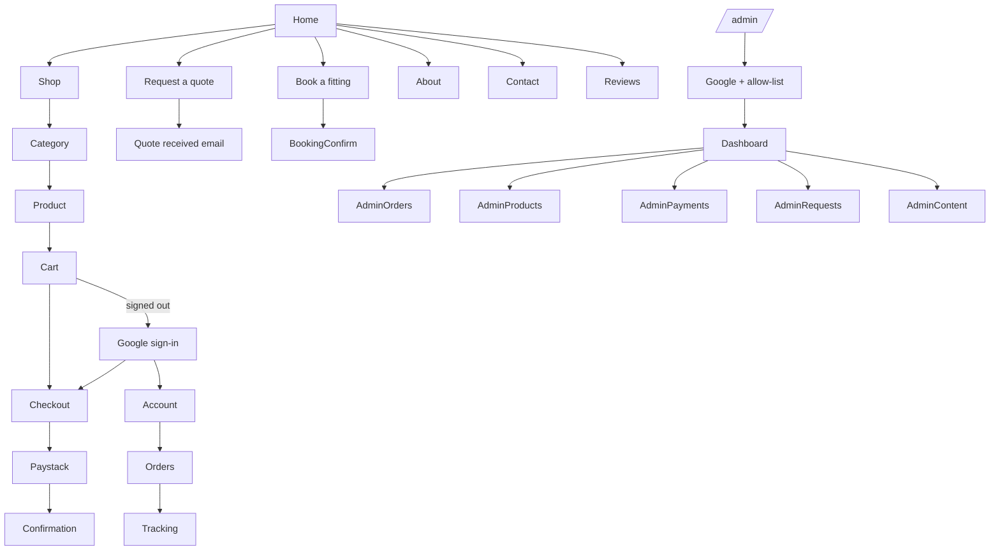
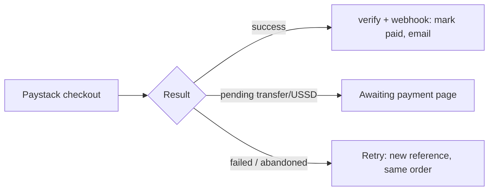
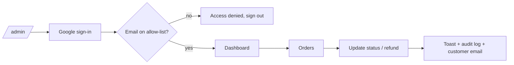

# Sitemap & flows (Mermaid source for `01-sitemap-and-flows.png`)

```mermaid
flowchart TD
  Home --> Shop --> Category --> Product --> Cart --> Checkout --> Paystack --> Confirmation
  Home --> Quote[Request a quote] --> QuoteConfirm[Quote received email]
  Home --> Booking[Book a fitting] --> BookingConfirm
  Home --> About & Contact & Reviews
  Cart -->|signed out| Login[Google sign-in] --> Checkout
  Login --> Account --> Orders --> Tracking
  Admin[/admin/] --> AdminLogin[Google + allow-list] --> Dashboard --> AdminOrders & AdminProducts & AdminPayments & AdminRequests & AdminContent
```

```mermaid
flowchart LR
  A[Paystack checkout] --> B{Result}
  B -->|success| C[verify + webhook: mark paid, email]
  B -->|pending transfer/USSD| D[Awaiting payment page]
  B -->|failed / abandoned| E[Retry: new reference, same order]
```

```mermaid
flowchart LR
  A[/admin/] --> B[Google sign-in] --> C{Email on allow-list?}
  C -->|no| D[Access denied, sign out]
  C -->|yes| E[Dashboard] --> F[Orders] --> G[Update status / refund] --> H[Toast + audit log + customer email]
```
